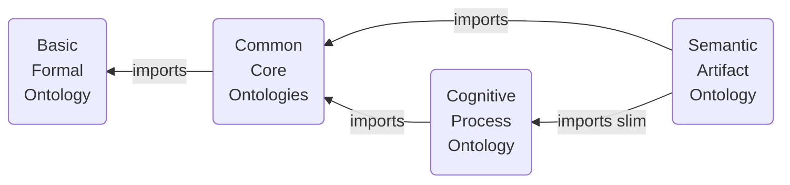
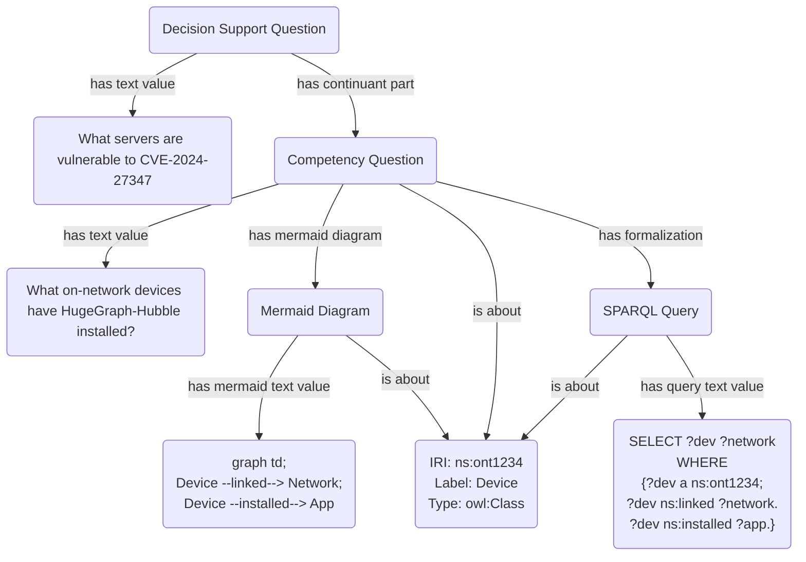

# Semantic Artifact Ontology
An ontology that represents semantic artifacts, especially those information entities used in knowledge engineering devops.

## Import Diagram

## Design Pattern Examples

## Articles on Interrogative Information Content Entities
- Braun, D. (2022). Propositions and Questions. In Chris Tillman and Adam Murray (Eds), *Routledge Handbook of Propositions*. https://doi.org/10.4324/9781315270500-34
  - This article is foundational to one of the most generic classes asserted in the ontology. It makes a distinction between the cognitive acts (act of wondering, act of asking, etc.), the informational contents, and the tokenizations (in concretizations, such as physical bearers of qualitise and verbal utterances).

### Competency Questions
- Grüninger, M., Fox, M.S. (1995). The Role of Competency Questions in Enterprise Engineering. In: Rolstadås, A. (eds) *Benchmarking — Theory and Practice. IFIP Advances in Information and Communication Technology.* Springer, Boston, MA. https://doi.org/10.1007/978-0-387-34847-6_3
- Ren, Y., Parvizi, A., Mellish, C., Pan, J.Z., van Deemter, K., Stevens, R. (2014). Towards Competency Question-Driven Ontology Authoring. In: Presutti, V., d’Amato, C., Gandon, F., d’Aquin, M., Staab, S., Tordai, A. (eds) *The Semantic Web: Trends and Challenges. ESWC 2014.* Lecture Notes in Computer Science, vol 8465. Springer, Cham. https://doi.org/10.1007/978-3-319-07443-6_50
- Dawid Wiśniewski, Jedrzej Potoniec, Agnieszka Ławrynowicz, C. Maria Keet, Analysis of Ontology Competency Questions and their formalizations in *SPARQL-OWL, Journal of Web Semantics*, Volume 59, 2019, 100534, ISSN 1570-8268, https://doi.org/10.1016/j.websem.2019.100534.
- Espinoza A, Del-Moral E, Martínez-Martínez A, Alí N. A validation & verification driven ontology: An iterative process. *Applied Ontology*. 2021;16(3):297-337. https://doi.org/10.3233/AO-210251
- Monfardini, G.K.Q., Salamon, J.S., Barcellos, M.P. (2023). Use of Competency Questions in Ontology Engineering: A Survey. In: Almeida, J.P.A., Borbinha, J., Guizzardi, G., Link, S., Zdravkovic, J. (eds) *Conceptual Modeling.* ER 2023. Lecture Notes in Computer Science, vol 14320. Springer, Cham. https://doi.org/10.1007/978-3-031-47262-6_3