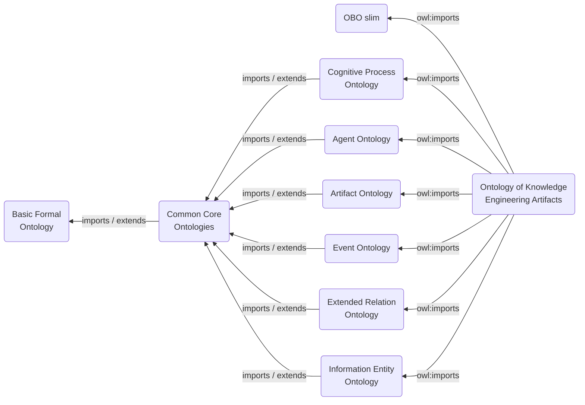
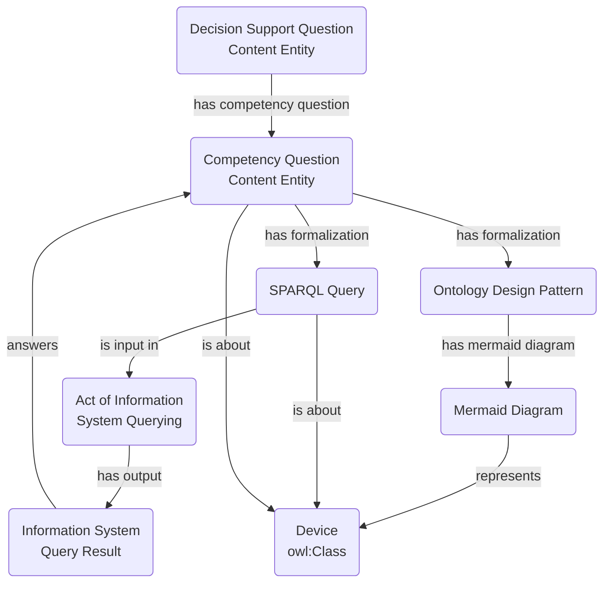

# Ontology of Knowledge Engineering Artifacts

The Ontology of Knowledge Engineering Artifacts is a reference ontology for semantic artifacts and the knowledge engineering processes, specifications, files, software, queries, tests, and release products that surround ontology and knowledge graph development.

The current milestone emphasizes reuse over duplication: when Common Core Ontologies, the CCO Cyber extension, CCO Cognitive Process Ontology, IAO, OBI, or SIO already provide a suitable class, OKEA reuses or specializes it rather than minting a parallel local class.

## Import Diagram

## Design Pattern Examples

## Documentation

MkDocs-ready documentation is in `docs/`.

- `docs/index.md` gives an ontologist-oriented overview.
- `docs/theory-and-patterns.md` explains the design theory and modeling commitments.
- `docs/mermaid/` contains standalone Mermaid source files for common paradigmatic patterns.

## Articles on Interrogative Information Content Entities

- Braun, D. (2022). Propositions and Questions. In Chris Tillman and Adam Murray (Eds), *Routledge Handbook of Propositions*. https://doi.org/10.4324/9781315270500-34
  - This article is foundational to one of the most generic classes asserted in the ontology. It distinguishes cognitive acts, such as asking or wondering, from the informational contents of questions and from their tokenizations.

### Competency Questions

- Grueninger, M., Fox, M.S. (1995). The Role of Competency Questions in Enterprise Engineering. In Rolstadas, A. (eds), *Benchmarking - Theory and Practice*. IFIP Advances in Information and Communication Technology. Springer, Boston, MA. https://doi.org/10.1007/978-0-387-34847-6_3
- Ren, Y., Parvizi, A., Mellish, C., Pan, J.Z., van Deemter, K., Stevens, R. (2014). Towards Competency Question-Driven Ontology Authoring. In Presutti, V., d'Amato, C., Gandon, F., d'Aquin, M., Staab, S., Tordai, A. (eds), *The Semantic Web: Trends and Challenges*. ESWC 2014. Lecture Notes in Computer Science, vol 8465. Springer, Cham. https://doi.org/10.1007/978-3-319-07443-6_50
- Wisniewski, D., Potoniec, J., Lawrynowicz, A., Keet, C.M. (2019). Analysis of Ontology Competency Questions and their formalizations in SPARQL-OWL. *Journal of Web Semantics*, 59, 100534. https://doi.org/10.1016/j.websem.2019.100534
- Espinoza, A., Del-Moral, E., Martinez-Martinez, A., Ali, N. (2021). A validation & verification driven ontology: An iterative process. *Applied Ontology*, 16(3), 297-337. https://doi.org/10.3233/AO-210251
- Monfardini, G.K.Q., Salamon, J.S., Barcellos, M.P. (2023). Use of Competency Questions in Ontology Engineering: A Survey. In Almeida, J.P.A., Borbinha, J., Guizzardi, G., Link, S., Zdravkovic, J. (eds), *Conceptual Modeling*. ER 2023. Lecture Notes in Computer Science, vol 14320. Springer, Cham. https://doi.org/10.1007/978-3-031-47262-6_3
