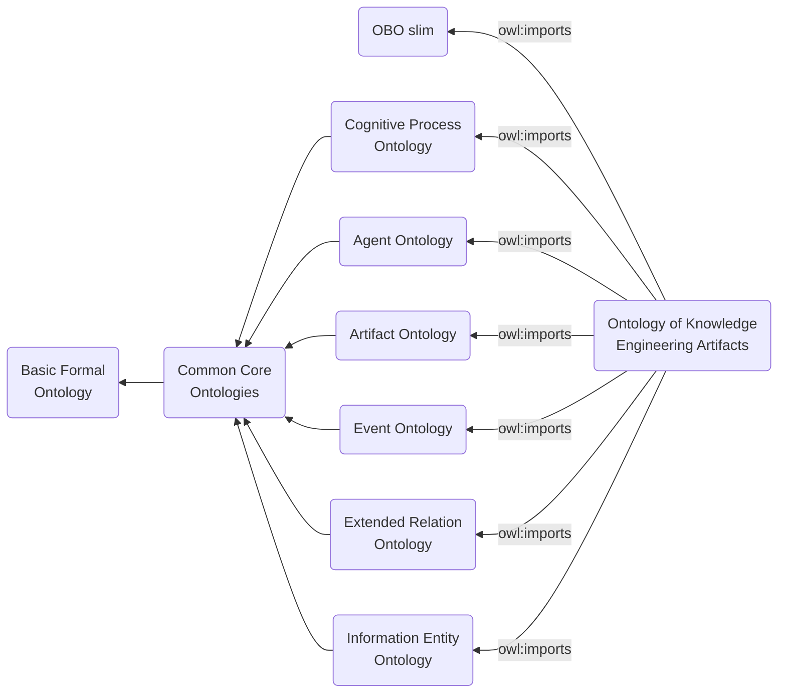

# Ontology of Knowledge Engineering Artifacts

The Ontology of Knowledge Engineering Artifacts (OKEA) represents the information artifacts, specifications, files, software, planned processes, and release products that occur in ontology and knowledge graph engineering.

OKEA is written for ontologists who need to talk precisely about the artifacts around an ontology, not only about the domain represented by the ontology. It covers entities such as competency questions, SPARQL queries, ontology design patterns, SHACL shape files, ROBOT templates, ontology release artifacts, profile validation acts, ontology merge acts, and CI/CD pipeline configurations.

## Design Commitments

OKEA follows four modeling commitments at this milestone.

1. Reuse before minting. Imported CCO, CCO extension, IAO, OBI, and SIO classes are reused where they have the right extension.
2. No asserted polyhierarchy for local classes. A local class should normally have one asserted parent; richer semantics should be supplied by relations, axioms, and equivalence patterns.
3. Processes and outputs are distinct. An ontology measuring act, a measurement output, and a metric specification are different entities.
4. Tool-neutral classes with tool-specific examples. ROBOT, Protege, and other tools may be cited as examples, but the class should usually be about the generic knowledge engineering act or artifact.

## Current Import Structure

## Diagrams

Standalone Mermaid sources are in [mermaid/](mermaid/). They are intended to be copied into issue discussions, architecture reviews, release documentation, and MkDocs pages.

Start with:

- [Querying and return pattern](mermaid/querying-process.mmd)
- [Competency question formalization pattern](mermaid/competency-question-formalization.mmd)
- [CI/CD ontology release pattern](mermaid/cicd-ontology-release.mmd)
- [Ontology merge and release product pattern](mermaid/ontology-merge-release.mmd)
- [Profile validation and materialization pattern](mermaid/profile-validation-materialization.mmd)

